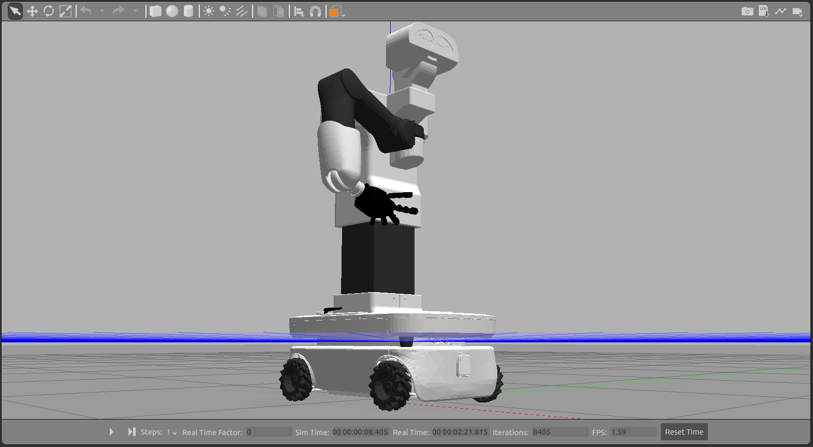
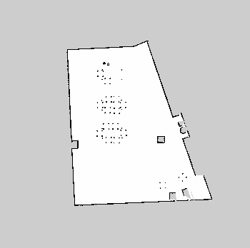
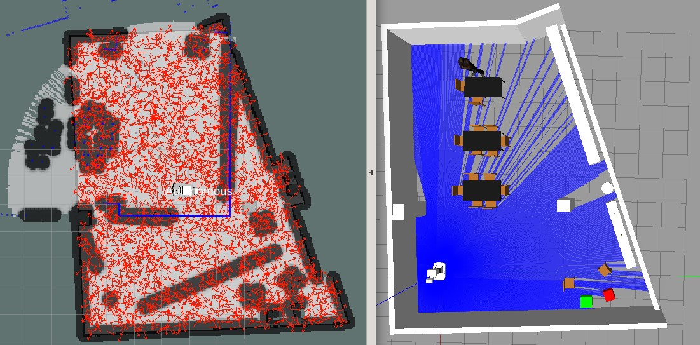

# Mapping with TIAGo OMNI

This repository presents the process of exploration, localization, and navigation in a previously unknown map in ROS. For this purpose, the TIAGo robot from PAL Robotics is used with its omni-directional wheel configuration.

The necessary software requirements for this project can be found [here](https://github.com/crisarenas/Mapping-TIAGo/blob/main/Software_Requirements.md).


<p align="center">

</p>


<details>
<summary><h2>Exploration</h2></summary>
The goal of exploration is to contruct a complete map of the environment.

Exploring an unknown environment requires mapping and modeling the environment, and at the same time localizing the robot within it. This process implies using SLAM techniques (Simultaneous Localization and Mapping) along with exploration and planning algorithms. 

The sensors that TIAGo uses to scan the environment are **two LIDARs (SICK TiM561)**, and the ROS package used for this is known as GMapping. GMapping updates the map in real-time as the sensors collect data.

First, open a terminal and navigate to the TIAGo workspace. Then, run the following command to add the packages in the TIAGo project to the ROS system's package path. The command should be executed every time a new terminal window is opened within the workspace. 

```
source ./devel/setup.bash
```

To launch the Gazebo TIAGo simulation with the omni base configuration, run the following command in a terminal. This launch file will open RViz to visualize the mapping process, remove the robot's arm and end effector (which are not necessary for this project), and load the kitchen world in Gazebo.

```
roslaunch tiago_2dnav_gazebo tiago_mapping.launch public_sim:=true base_type:=omni_base arm:=false end_effector:=false world:=pal_kitchen
```

Then, in a separate terminal, run the following command to control the robot using the keyboard arrows. Unfortunately, despite having a holonomic robot, the control is limited to rotating the base on itself and moving forward and backward.

```
rosrun key_teleop key_teleop.py
```

Now, explore the world until a precise map of it is constructed. The mapping process on Gazebo (real state) can be seen on the right, and the mapping process in RViz (robot state) can be seen on the left:

<p align="center">

</p>


Once the map has been fully explored, save it by running the command below. In this case, I have chosen to name the map "tiago_kitchen". The map will be saved in the path: "/home/user/.pal/tiago_maps/tiago_kitchen".

```
rosservice call /pal_map_manager/save_map "directory: 'tiago_kitchen'"
```

Now, all terminals can be stopped. The resulting map is shown below.
<p align="center">

</p>
</details>


_____________
<details>
<summary><h2>Localization</h2></summary>

The kitchen map is already built. The following command opens the kitchen world in Gazebo, the created map in RViz, and places the robot in a random position in the environment. Then, AMCL localization is used to estimate the real position of the robot.


```
roslaunch tiago_2dnav_gazebo tiago_navigation.launch public_sim:=true lost:=true world:=pal_kitchen base_type:=omni_base arm:=false end_effector:=false map:=$HOME/.pal/tiago_maps/configurations/tiago_kitchen
```


To localize the robot, run the following command:


```
rosservice call /global_localization "{}"
```


As shown in the image below, the robot is lost in the map, which means that RViz and Gazebo do not correspond. This is where AMCL comes into play, a probabilistic localization system that uses a particle filter to estimate the pose of a robot in a known environment. The blue lines in RViz are the points measured by the LIDAR.
The red arrows are the particles that represent possible poses of the robot. As we move, we will use odometry and LIDAR information to converge the particle filter on the position of the highest probability.


<p align="center">

</p>

Now, help the particle filter to converge by moving the robot using teleoperation.
```
rosrun key_teleop key_teleop.py
```

Once the robot is localized, it's necessary to clear the previous costmaps as they may contain incorrect data used for route planning. By deleting the old costmaps, the robot can generate new ones based on its current position and detected obstacles, resulting in a more accurate and reliable route planning. To clear the costmaps, use the following command:

```
rosservice call /move_base/clear_costmaps "{}"
```

The localization process is shown in the following image

<p align="center">

</p>

</details>


___
<details>
<summary><h2>Navigation</h2></summary>
Kill the teleoperation node and use the 2D Nav Goal tool in RViz to indicate the final position and orientation of the robot. A global planner will then compute a path for the robot to follow.


<p align="center">

</p>

</details>


____

## Highlights and Challenges
* Comparativa turtlebot.
* No poder teleoperar el modo omnidirecional por completo.
* 