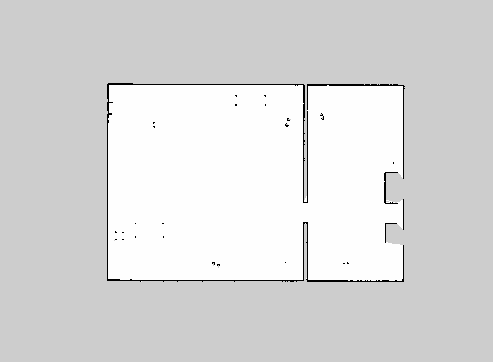

# Mapping with TIAGo Omni

This repository presents the results of using the TIAGo Omni robot for exploring and mapping an unknown environment (SLAM) and then navigating it. The necessary software requirements for this project can be found [here](https://github.com/crisarenas/Mapping-TIAGo/blob/main/Software_Requirements.md).

The robot used is the TIAGo robot from PAL Robotics. One of its configurations has omnidirectional wheels as can be seen in the following image.


## Mapping
The first goal is to explore the environment and build a map of it using the robot. This can be achieved by utilizing gmapping along with the sensors available on the omnidirectional TIAGo, such as the 2 LIDAR sensors (SICK TiM561) and a 6DoF IMU.

First, open a terminal, navigate to the TIAGo workspace and run the following command:

```
source ./devel/setup.bash
```

To launch the Gazebo TIAGo simulation with the omni base configuration, run the following command in a terminal. This command also opens RViz to visualize the mapping process and removes the arm and end effector of the robot, which are not necessary for this project.

```
roslaunch tiago_2dnav_gazebo tiago_mapping.launch public_sim:=true base_type:=omni_base arm:=false end_effector:=false world:=simple_office_with_people
```

Then, in a separate terminal, run the following command to control the robot using the keyboard arrows. 

```
rosrun key_teleop key_teleop.py
```
Once the map has been fully explored, we can save it by running the command below. In this case, I have chosen to name the map "office". The map will be saved in the path: "/home/user/.pal/tiago_maps/office/".

```
rosservice call /pal_map_manager/save_map "directory: 'office'"
```
Now, all terminals can be stopped. The resulting map is shown below.


## Localization


## Navigation
