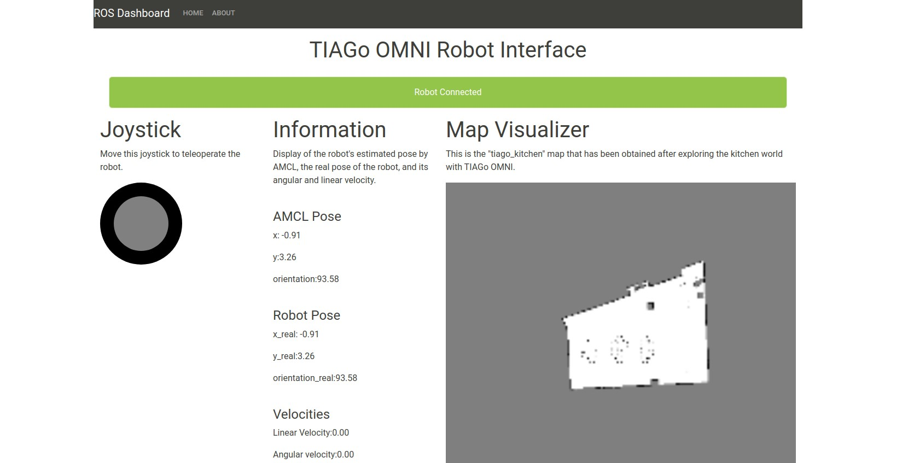

# Web Interface
The web dashboard for TIAGo is designed to provide various functionalities such as joystick-based teleoperation, displaying position and velocity information, and visualizing the map generated during exploration. Users can teleoperate the robot using the joystick or click on a specific position on the map for the robot to navigate to.

**To access the source code of the web development, please refer to the [software requirements](https://github.com/crisarenas/Mapping-Holonomic/blob/main/Software_Requirements.md) section.**

To create this web application, the following tools were used:

* **React**: A JavaScript library used for building user interfaces. React allows for the efficient creation of interactive and reusable UI components.

* **Bootstrap**: A free and open-source CSS framework that provides pre-designed templates and components for responsive web design.

* **Robot Web Tools**: A collection of open-source modules specifically designed for building mobile robot applications. In this project, we utilized the following modules:

    * ROSLIBJS: A JavaScript library that provides communication capabilities with ROS (Robot Operating System) from the web browser. It enables interaction between the web application and the robot's ROS ecosystem.

    * NAV2D: A module that facilitates the visualization of a 2D occupancy grid map and allows for navigation-related functionalities, such as setting navigation goals.

    * ROS2D: A module that enables the rendering of ROS-related visualizations, including maps and robot markers.

* **ROSBridge**: It acts as a bridge between the ROS ecosystem and the web application. ROS system, enabling data exchange and control.

Please click the image below to see the web interface in action and gain a better understanding of the React project:

